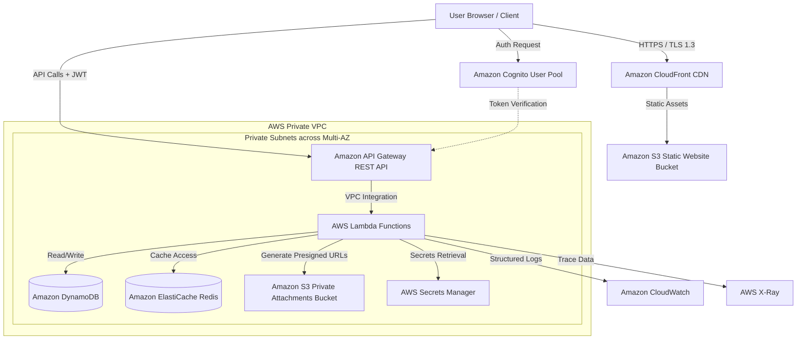
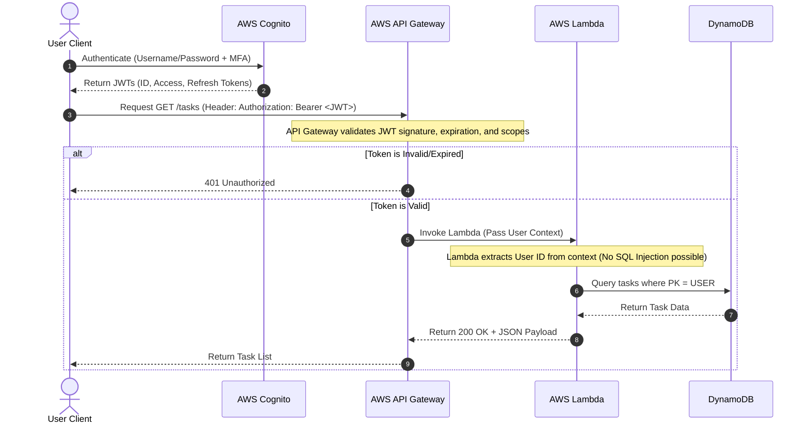

# Security & Architecture Review
## Ticket: SCRUM-79 — Personal Task Management Application
**Author:** Jordan (Principal System Architect)  
**Date:** June 3, 2026  
**Status:** Approved with Architecture Blueprint  

---

## 1. Executive Summary

This document provides a comprehensive, security-first, cloud-native architecture blueprint and threat model for the **Personal Task Management Application (SCRUM-79)**. 

Since the current Pull Request (`PR #1`) contains an empty changeset (`+0 -0 across 0 files`), this review serves as the **authoritative architectural and security specification** that the development team must implement. All code pushed to the `feature/scrum-79-personal-task-management-application` branch will be evaluated against the standards, patterns, and security controls defined herein.

---

## 2. System Architecture

The application is designed using a **serverless, cloud-native, and security-hardened pattern** on AWS. This ensures high availability, horizontal scalability, zero-maintenance overhead, and a minimal attack surface.

### 2.1 Architecture Diagram



### 2.2 Component Breakdown

| Component | Technology | Security & Architectural Role |
| :--- | :--- | :--- |
| **Frontend Hosting** | AWS S3 + CloudFront | Static React SPA hosting. CloudFront enforces HTTPS (TLS 1.3), provides DDoS protection (AWS Shield Standard), and injects security headers (CSP, HSTS, X-Frame-Options). |
| **Identity Provider** | AWS Cognito User Pools | Handles user registration, secure SRP-based authentication, MFA (TOTP/SMS), password policies, and JWT generation. |
| **API Gateway** | AWS API Gateway (REST) | Acts as the single entry point. Enforces rate limiting (throttling), CORS policies, and validates JWTs via Cognito Authorizer before invoking backend compute. |
| **Compute** | AWS Lambda (TypeScript) | Serverless, event-driven compute. Runs in private subnets with no public IP addresses. Enforces strict execution timeouts (max 10s) and implements circuit breakers for external integrations. |
| **Database** | Amazon DynamoDB | NoSQL database with single-table design. Encrypted at rest using AWS KMS Customer Managed Keys (CMK). Point-in-Time Recovery (PITR) enabled. |
| **Caching** | Amazon ElastiCache (Redis) | Caches active tasks, user profiles, and dashboard statistics to reduce DynamoDB read costs and latency. |
| **Object Storage** | Amazon S3 (Private) | Stores task attachments. Block Public Access enabled. Access is strictly controlled via short-lived (15-minute) S3 Presigned URLs. |
| **Secrets Management** | AWS Secrets Manager | Stores database credentials, API keys, and third-party tokens. Automatically rotated. |

---

## 3. Security Architecture & Zero-Trust Design

We apply a **Zero-Trust Security Model**: *Never trust, always verify.* Every request, service-to-service call, and data access must be authenticated, authorized, and encrypted.

### 3.1 Authentication & Authorization Flow



### 3.2 Key Security Controls

1. **Data Encryption**:
   - **In Transit**: Enforced TLS 1.3 for all endpoints (CloudFront, API Gateway, Cognito).
   - **At Rest**: AES-256 encryption enforced on DynamoDB, S3, and Secrets Manager using AWS KMS Customer Managed Keys (CMK) with automatic key rotation.
2. **Least-Privilege IAM Roles**:
   - Each Lambda function gets an isolated, dedicated IAM execution role.
   - No wildcard (`*`) permissions allowed. Lambda functions can only access their specific DynamoDB table and S3 prefix.
3. **Input Validation & Sanitization**:
   - All API inputs must be validated at the API Gateway level (using JSON Schema) and at the Lambda level using **Zod** schema validation.
   - Strict sanitization of all text inputs to prevent Cross-Site Scripting (XSS) and HTML injection.
4. **Secure S3 Attachment Access**:
   - The S3 bucket storing task attachments has `Block Public Access` fully enabled.
   - Files are uploaded and downloaded using **S3 Presigned URLs** generated by Lambda with an expiration of 900 seconds (15 minutes).
5. **Rate Limiting & DDoS Mitigation**:
   - AWS WAF (Web Application Firewall) is attached to CloudFront and API Gateway to block common web exploits (OWASP Top 10) and enforce rate limits (e.g., max 100 requests per 5 minutes per IP).

---

## 4. Threat Modeling (STRIDE Methodology)

| Threat Category (STRIDE) | Specific Threat | Mitigation Strategy |
| :--- | :--- | :--- |
| **Spoofing Identity** | Attacker intercepts or guesses user credentials to access tasks. | Enforce AWS Cognito with strong password policies, MFA (Multi-Factor Authentication), and secure SRP (Secure Remote Password) protocol. |
| **Tampering with Data** | Attacker modifies task payloads or parameters (e.g., changing task owner ID). | Enforce JWT validation at API Gateway. Lambda must extract the user identity directly from the validated JWT context (`requestContext.authorizer.claims.sub`) rather than trusting user-supplied body parameters. |
| **Repudiation** | User claims they did not delete a critical task, and there is no audit trail. | Implement structured JSON logging (using Pino/Winston) to Amazon CloudWatch. Enable CloudTrail for all AWS API calls. Log all state-changing actions (Create, Update, Delete) with User ID and Timestamp. |
| **Information Disclosure** | Attacker gains access to task attachments or database records. | Enforce KMS encryption at rest. Enforce TLS 1.3 in transit. Block public access to S3. Use short-lived S3 Presigned URLs for attachments. |
| **Denial of Service** | Attacker floods the API with requests, exhausting resources or inflating costs. | Implement API Gateway throttling limits (e.g., 100 RPS per user). Attach AWS WAF with rate-limiting rules. Use DynamoDB Auto-Scaling to handle traffic spikes gracefully. |
| **Elevation of Privilege** | Compromised Lambda function accesses other AWS resources or databases. | Enforce strict, single-purpose IAM roles for each Lambda function. Use VPC Security Groups to restrict network access to only necessary endpoints. |

---

## 5. Performance, Scalability & Resilience

### 5.1 Caching Strategy
- **Read-Heavy Workloads**: Task lists and dashboards are highly read-heavy. We implement a **Cache-Aside Pattern** using Amazon ElastiCache for Redis.
- **Cache Invalidation**: Cache is invalidated or updated immediately upon any write operation (Create, Update, Delete) for that specific user's tasks.

### 5.2 Resilience & Fault Tolerance
- **Multi-AZ Deployment**: Lambda functions and ElastiCache are deployed across three Availability Zones (AZs). DynamoDB natively replicates data across multiple AZs.
- **Timeouts & Retries**:
  - All database and external API calls must have explicit timeouts configured (e.g., database query timeout of 2 seconds).
  - Implement exponential backoff with jitter for retries on transient network failures.
- **Circuit Breaker Pattern**:
  - For external integrations (e.g., sending email notifications via Amazon SES or third-party APIs), implement a circuit breaker (e.g., using `opossum` in Node.js) to fail fast and prevent resource exhaustion when the external service is down.

---

## 6. Observability & Tracing

A system is only as good as its observability. We enforce three pillars of observability from day one:

1. **Structured Logging**:
   - All logs must be written in structured JSON format to standard output (stdout), which is automatically collected by CloudWatch.
   - Every log entry must include: `timestamp`, `log_level`, `correlation_id` (Trace ID), `user_id`, `service_name`, and `message`.
2. **Distributed Tracing**:
   - AWS X-Ray (or OpenTelemetry) is enabled across API Gateway, Lambda, and DynamoDB.
   - The `x-amzn-trace-id` header is propagated through all service boundaries to trace requests end-to-end.
3. **Metrics & Dashboards**:
   - Track key performance indicators (KPIs): API Latency (p50, p95, p99), HTTP 4xx/5xx error rates, Lambda throttling, and DynamoDB consumed read/write capacity.

---

## 7. Infrastructure as Code (IaC)

To ensure consistency, repeatability, and security compliance, all infrastructure must be defined using **Terraform**. 

Below is the reference Terraform structure for the core security and database resources:

```hcl
# main.tf - Core Infrastructure for Personal Task Management

terraform {
  required_version = ">= 1.5.0"
  required_providers {
    aws = {
      source  = "hashicorp/aws"
      version = "~> 5.0"
    }
  }
}

provider "aws" {
  region = var.aws_region
}

# KMS Key for Database Encryption
resource "aws_kms_key" "db_key" {
  description             = "KMS Key for Task Management DynamoDB"
  deletion_window_in_days = 30
  enable_key_rotation     = true

  tags = {
    Environment = var.environment
    Project     = "TaskManagement"
  }
}

# DynamoDB Table with Single-Table Design
resource "aws_dynamodb_table" "task_table" {
  name             = "${var.environment}-tasks"
  billing_mode     = "PAY_PER_REQUEST"
  hash_key         = "PK"
  range_key        = "SK"

  attribute {
    name = "PK"
    type = "S"
  }

  attribute {
    name = "SK"
    type = "S"
  }

  point_in_time_recovery {
    enabled = true
  }

  server_side_encryption {
    enabled     = true
    kms_key_arn = aws_kms_key.db_key.arn
  }

  tags = {
    Environment = var.environment
    Project     = "TaskManagement"
  }
}

# S3 Bucket for Private Attachments
resource "aws_s3_bucket" "attachments" {
  bucket        = "${var.environment}-task-attachments-secure"
  force_destroy = false

  tags = {
    Environment = var.environment
    Project     = "TaskManagement"
  }
}

# Enforce Block Public Access on S3
resource "aws_s3_bucket_public_access_block" "attachments_block" {
  bucket = aws_s3_bucket.attachments.id

  block_public_acls       = true
  block_public_policy     = true
  ignore_public_acls      = true
  restrict_public_buckets = true
}

# Enforce Encryption on S3
resource "aws_s3_bucket_server_side_encryption_configuration" "attachments_encryption" {
  bucket = aws_s3_bucket.attachments.id

  rule {
    apply_server_side_encryption_by_default {
      sse_algorithm = "AES256"
    }
  }
}
```

---

## 8. Implementation Checklist for Developers

Developers must ensure that their implementation meets the following criteria before submitting code for review:

- [ ] **Authentication**: All endpoints (except health check) require a valid Cognito JWT.
- [ ] **Input Validation**: Every request payload is validated using a schema validator (e.g., Zod).
- [ ] **No Hardcoded Secrets**: All secrets, database keys, and external tokens are retrieved from AWS Secrets Manager or SSM Parameter Store.
- [ ] **Structured Logs**: All logs are in JSON format and include a correlation ID.
- [ ] **Error Handling**: No raw stack traces are returned to the client. All errors are caught, logged, and returned as clean HTTP error responses (e.g., `{ "error": "Internal Server Error", "requestId": "..." }`).
- [ ] **Unit & Integration Tests**: Minimum 80% code coverage, including happy path and edge cases (unauthorized access, invalid inputs, database timeouts).
- [ ] **IaC**: Any new AWS resource must be accompanied by its corresponding Terraform configuration.
